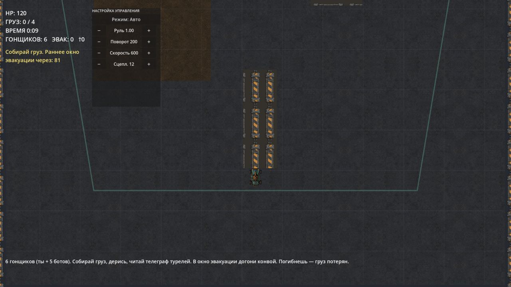

# Dead Route

Dead Route is a browser-playable top-down vehicle combat and extraction prototype built with Godot and exported to WebAssembly.

**[Play the live demo](https://sevakode.github.io/dead-route-web/)**

## Gameplay

You race alongside five AI-controlled drivers, collect cargo, fight for survival, avoid telegraphed turret fire, and catch the evacuation convoy before the window closes. If your vehicle is destroyed, the collected cargo is lost.

The current build uses a Russian in-game interface and is best experienced in a desktop browser.

## Repository scope

This repository contains the compiled Godot Web export:

- HTML and JavaScript loader files
- a WebAssembly game binary
- the packaged game data
- GitHub Pages deployment assets

The editable Godot source project is not included. This repository is therefore a runnable demo, not a reusable source-code release.

## Technical notes

- Engine: Godot
- Target: browser / WebAssembly
- Hosting: GitHub Pages
- Rendering: HTML canvas

The initial load includes the WebAssembly binary and packaged assets, so it may take a few seconds on a slower connection.

## Status and licensing

This is an experimental prototype. No open-source license is declared for the compiled game or its assets.
